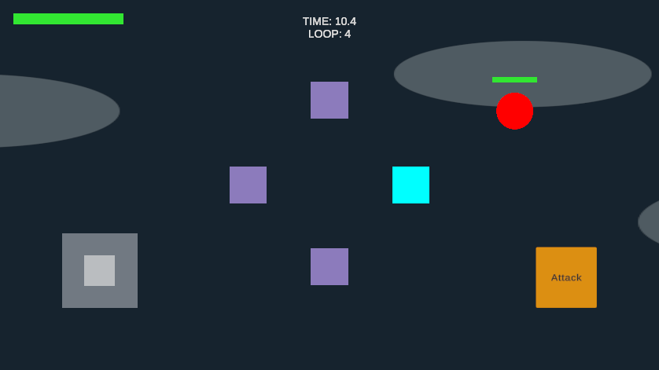

# M1.2 — Multiple Ghosts

Status: DONE for M1.2 acceptance, verified 2026-09-21. Stopped for user review.

## Scope and implementation

Unity 6000.6.0f1, authored GameScene, 20-second loops. This milestone extends M1.1 movement replay; action playback remains M1.3.

`TemporalGhostManager` keeps history ordered oldest to newest. Each Ghost owns a bounded `PlayerTimeline` snapshot copied at rewind. This is necessary because the recorder reuses two writable buffers: retaining those references would overwrite older Ghost paths.

The manager creates at most three Ghost objects. At capacity, it removes the oldest history, clears that playback reference, and reuses the same object and snapshot storage for the completed loop. There is no transient fourth Ghost and no recurring Instantiate/Destroy or timeline-buffer allocation after filling the three slots. All retained Ghosts restart at time zero after rewind and use the existing shared loop clock.

| Current loop | Replayed source loops |
|---|---|
| 1 | None |
| 2 | 1 |
| 3 | 1, 2 |
| 4 | 1, 2, 3 |
| 5 | 2, 3, 4 |

`maxGhosts` is clamped to 1–3 and fixed at run initialization; GameScene is configured to 3 through Unity MCP. There is no runtime upgrade for this limit in M1.2. The recorder retains its existing two buffers, and the manager adds at most three bounded snapshots. At current settings each buffer has 403 pose slots and 256 reserved action slots.

Restart uses the existing GameManager scene reload: all scene-owned Ghost objects, manager history and recorder are discarded. Game Over retains history while the existing gameplay clock stops. Ghosts still have only Transform, SpriteRenderer and GhostPlayback, without Player tag, input, Health or colliders.

## Changed files and scene

- Modified `Assets/Scripts/Temporal/PlayerTimeline.cs`: bounded snapshot copy and capacity accessors.
- Modified `Assets/Scripts/Temporal/TemporalGhostManager.cs`: three-slot history, oldest eviction/reuse, replay reset and teardown.
- Modified `Assets/Scenes/GameScene.unity` through MCP: existing Managers/TemporalGhostManager `maxGhosts = 3`. No new saved GameObject or prefab.
- Modified `Assets/Tests/TemporalGhostPlayModeChecks.cs`: replace deprecated object lookup API so M1.1 probe remains compilable on Unity 6.6.
- Added `Assets/Tests/MultipleGhostPlayModeChecks.cs` and Unity-generated `.meta`: editor-only integration probe, never attached to the final saved scene.
- Updated `ROADMAP.md`; added this report, `playmode-results.txt` and `multiple-ghosts.png`.

## Test method

Open GameScene in Edit Mode, create a temporary object with `MultipleGhostPlayModeChecks`, then enter Play Mode. The probe runs natural 20-second loops with timeScale 1. It injects synthetic pointer events into VirtualJoystick, uses different paths across four consecutive loops, and saves separate expected recordings. Every monitored LateUpdate checks actual scene Ghost count and each Ghost position against its saved source timeline. At each rewind it compares every retained pose sample and source-loop identity, verifies restart at time zero, and verifies old-slot reuse at capacity.

The test temporarily disables EnemyFollow to keep recording paths safe, then restores it for chase/contact regression. It checks Enemy death/rewind restoration, Player HP restoration, attack, overlapping an Enemy with a Ghost, pause, Game Over, Restart from Game Over, a fresh rewind after Restart, Restart during active gameplay and Main Menu cleanup. A persistent single probe owns the test across scene reloads. Exit Play Mode and remove the temporary edit-mode probe afterward; do not save it into the gameplay scene.

Synthetic pointer dispatch and programmatic GameManager navigation verify code paths. They do not verify physical touchscreen hit targets, simultaneous multi-touch, Android rendering smoothness or device performance.

## Results

Final complete run: **81 checks PASS**, **38,107 monitored frames**, maximum active Ghosts **3**, maximum measured positional error against the saved source recordings **0**. Four consecutive natural rewinds verified the full history table; a fifth natural rewind after Restart verified fresh recording lifecycle. Every retained pose sample was checked at loop boundaries, including after Game Over.

Passed: synthetic joystick independence; Ghost component isolation and Enemy overlap; pause; Game Over with three Ghosts; attack/chase/contact; Player and dead Enemy restoration; Restart after Game Over; one new Ghost after the restarted run's first rewind; Restart during active play; Main Menu cleanup. Raw output: [playmode-results.txt](playmode-results.txt).

Compile succeeded after replacing deprecated Unity 6.6 lookup/identity APIs in the test probes. The initial test attempt exposed duplicate temporary probes after Editor scene reload; the probe now has a persistent single-instance guard, and the entire test was rerun successfully. Production code did not require a fix during that rerun.

Final state: exited Play Mode, removed temporary probe, saved GameScene, seven original scene roots, no missing scripts, all Ghost manager references present, maxGhosts serialized as 3. Unity's native Console counts were **0 errors, 0 warnings, 83 informational logs**. MCP classified the success summary containing the word `assertions` as `Assert`; native Console counts and the source `Debug.Log` call confirmed it was informational. `git diff --check` passed.

## Manual review and limitations

1. Use the joystick to end Loops 1, 2 and 3 at different positions. Confirm Loop 4 replays three paths while the cyan Player moves independently.
2. Complete Loop 4. Confirm the Loop 1 path disappears and the remaining Ghosts replay Loops 2, 3 and 4.
3. Trigger Game Over with three Ghosts; confirm everything freezes. Tap Restart and confirm a fresh run with no Ghosts. Test the Main Menu button too.
4. On Android, test move + Attack with two fingers, release/re-touch joystick, and judge Ghost smoothness/readability.

Ghost visuals remain translucent purple primitive sprites, so coincident paths can overlap visually. Distinct attack/dash/interaction playback, Ghost count HUD and final visual polish are not implemented here. No Android build or device-touch result is claimed. No commit/push is performed. Next milestone after review: M1.3 — Action Timeline.
