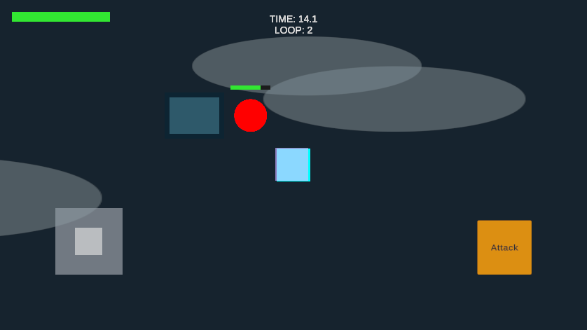
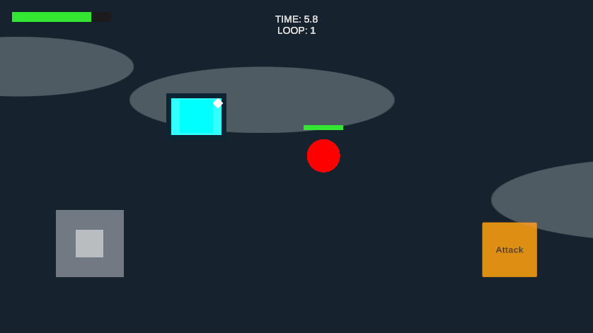

# M2.1 — Pressure Switch

Status: DONE for M2.1 acceptance, verified 2026-09-21 in Unity 6000.6.0f1.

## Scope and architecture

Reusable `PressureSwitch` and prefab, with a demo instance at (-3, 1.5) in GameScene. No Door, dual-switch puzzle, package installation or M2.2 implementation.

`PressureSwitchActor` is an explicit opt-in. The Player is configured in GameScene; GhostPlayback configures the same component when creating its non-physical replay actor. Enemies and arbitrary colliders do not press switches.

Player occupancy uses its enabled root/child Collider2D geometry. Any overlapping eligible collider means one occupant, regardless of the number of colliders. Ghost occupancy deliberately uses its recorded Transform anchor inside the switch area; no Ghost collider, Rigidbody, Health or input is added. This preserves the existing collision and damage isolation. At a plate edge, Player body overlap can activate earlier than the Ghost anchor; stand clearly on the plate when recording a hold.

An enabled-actor registry avoids scene searches each frame. The switch reconciles occupancy after Ghost LateUpdate, so collider disable, actor destruction, teleports and one actor leaving while another remains cannot leak callback counts. Collider arrays are cached; call `RefreshColliders()` after changing an opted-in actor's collider hierarchy at runtime. No recurring allocation is needed for steady-state occupancy checks.

Public integration: `IsActive`, `OccupantCount`, C# `StateChanged(bool)` and serialized `onStateChanged` UnityEvent<bool>. Events fire only when the boolean state changes, after the new count/state/visual are assigned. A future Door can subscribe or be wired in Inspector without switch-specific door logic.

The switch implements `ITimeLoopResettable`. Its momentary initial state is inactive, with zero occupants. Rewind clears output immediately and suppresses occupancy evaluation for the reset frame; the following gameplay frame evaluates actors at their new positions. An actor beginning a loop inside a switch can therefore activate it again. Pause/Game Over freeze evaluation with the existing gameplay timescale.

Inactive: muted blue plate, dark border, corner light off. Active: bright cyan plate and white diamond light. Visual review moved the light to the corner so a centered Player does not obscure it. The sensor size is fixed; visuals do not resize the trigger. The prefab has no scene-manager reference and can be reused in other rooms.

## Changed files and scene

- New `Assets/Scripts/Environment/PressureSwitch.cs` and `PressureSwitchActor.cs`.
- New `Assets/Prefabs/PressureSwitch.prefab`, prefab folder metadata and script metadata generated by Unity.
- Modified `Assets/Scripts/Temporal/GhostPlayback.cs`: create/configure opt-in actor, disable it when playback is cleared.
- Modified `Assets/Scenes/GameScene.unity` through Unity MCP: Player gains `PressureSwitchActor`; add one Pressure Switch prefab instance with BoxCollider2D trigger, PressureSwitch, and Base/Plate/Active Light visual children.
- New editor-only `Assets/Tests/PressureSwitchPlayModeChecks.cs` and metadata.
- Updated `ROADMAP.md`; added this review, screenshots and test output.

## Verification

**38 checks PASS**, two natural 20-second rewinds, **14,641 monitored frames**, maximum Ghost movement error **0**, **18 matching C#/Inspector state transitions**. [Raw output](playmode-results.txt).

Passed: Player activate/deactivate with two colliders counted once; remaining collider keeps the switch active; collider departure, disabled actor and destroyed actor cleanup; Enemy exclusion; Ghost activation from real recorded movement; simultaneous Player/Ghost count of two; either actor departing while the other keeps holding without false events; switch disable/re-enable; reset from Player-held and Ghost-held states; multiple Ghost history; Player/Ghost attacks dealing exactly 25 damage without Player friendly fire; Enemy chase/contact; Game Over freeze and Restart cleanup.

Compile succeeded without source errors. A transient MCP WebSocket warning appeared after the first domain reload; the connection recovered and the subsequent compile/test/final Console had no errors or warnings. The unfocused Editor initially stopped advancing before the probe's Start; enabling background execution temporarily resumed it. The original false setting was restored afterward.

Final GameScene: saved via Unity MCP, outside Play Mode, eight roots, one connected switch prefab, correct visual references, Player opt-in, maxGhosts = 3, no missing scripts and no saved test probe. No commit/push, package installation or .gitignore changes.

The runtime-only probe uses actual Player movement and two natural 20-second rewinds, then Game Over/Restart. It temporarily adds a second child collider and a disposable opt-in actor, and controls Enemy chase/contact to isolate damage before testing those paths. Every monitored running frame compares Ghost position with its recording. C# and Inspector-event transition counts must agree. Test objects are never saved into GameScene.

To rerun: enter Play Mode with GameScene, temporarily enable `Application.runInBackground` if the editor is unfocused, then create a runtime GameObject with `PressureSwitchPlayModeChecks`. Exit Play Mode and restore the previous background setting afterward.

## Manual review and limitations

1. Move onto/off the plate above-left of Player; check cyan/white active feedback and dark inactive feedback.
2. Record standing clearly at its center, wait for rewind, then watch the Ghost hold it while the live Player moves independently.
3. Join/leave the Ghost on the plate, and test joystick + Attack and Restart on an Android device.

Movement in the automated probe is supplied through PlayerMovement; this does not verify physical mobile touch or multitouch. No Android build/performance claim. Art is a readable primitive foundation; SFX and full puzzle feedback remain later milestones. Ghosts use an anchor, Player uses collider overlap; fast pass-through between sampled frames is not a latched press. This switch is intended for pressure holds.

Next milestone after review: M2.2 — Door. Stop at M2.1.
