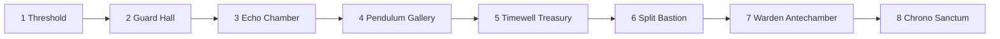

# M4.2 — Authored Dungeon Layout

Verified 2026-09-21, Unity 6000.6.0f1 through Unity MCP. This milestone completes the authored eight-room layout and its traversal. It does not complete the later trap, upgrade, elite or boss systems.

## Route and scene coordinates

The scene is authored as two rows. The first row runs west to east; the second runs east to west. Transitions use the established portal/room-entry model, without corridor streaming or procedural generation.

| # | Room / role | Center (x,y) | Current clear rule | Layout intent / future content |
|---|---|---|---|---|
| 1 | Threshold / Start | 0, 0 | OnEntry | Safe arrival dais and clear exit approach |
| 2 | Guard Hall / Combat | 24, 0 | Defeat 2 guards | Introductory combat, spaced enemies and column bases |
| 3 | Echo Chamber / Time Puzzle | 48, 0 | Dual-switch puzzle | Existing Ghost cooperation puzzle, original mechanism door plus dedicated room exit |
| 4 | Pendulum Gallery / Trap | 72, 0 | OnEntry | Alternating inactive grate lanes; three named hazard sockets for M6.4 |
| 5 | Timewell Treasury / Treasure | 72, -16 | OnEntry | Central offering plinth and Upgrade Reward Socket for Phase 7 |
| 6 | Split Bastion / Combat Challenge | 48, -16 | Defeat 3 guards | Two-sided enemy arrangement and four column bases |
| 7 | Warden Antechamber / Elite | 24, -16 | Defeat 1 existing guard | Dais and combat position reserved for the M5.5 elite; current guard is a stand-in with normal stats |
| 8 | Chrono Sanctum / Boss | 0, -16 | OnEntry | Wide arena, Chrono Guardian Spawn and two temporal mechanism sockets for Phase 8 |

Every room has its own Content, Player Spawn, Camera Anchor, Room Exit Door, Exit Trigger, EXIT label and authored visual blockout. Local spawn is (-6,0); exit door is (7.2,0.5), trigger (7.9,0.5). Room centers are separated, and only the active room's Content remains enabled at runtime. Player HP persists through transitions. Existing fresh-loop/history cleanup behavior remains in place.

## Files and scene changes in M4.2

New files:

- Assets/Scripts/Environment/RoomCamera.cs and .meta: serialized RoomManager reference; event-driven framing at each authored camera anchor, preserving camera Z.
- Assets/Tests/DungeonLayoutPlayModeChecks.cs and .meta: Editor-only full-layout regression probe.
- Docs/Testing/M4.2/REVIEW.md, playmode-results.txt and four screenshots.

Modified files:

- Assets/Scripts/Managers/Room.cs: RoomRole, cameraAnchor and read-only layout metadata for inspection/tests.
- Assets/Scenes/GameScene.unity: eight authored roots/content groups, serialized progression order, room framing and visual blockouts; edited/saved via MCP.
- ROADMAP.md: M4.2 scope/results and next milestone M4.3.

GameObject/component changes:

- Reused the original combat/puzzle room objects for Guard Hall and Echo Chamber. Added six authored Room roots under Rooms.
- Reused existing Door, Enemy, Health, EnemyFollow, TimeLoopActor and dual-switch components; no duplicate combat or puzzle system.
- Main Camera gains RoomCamera. Managers/RoomManager now references eight rooms.
- Disabled the old shared Environment root (background and global moving fog); retained it in the scene. Per-room floors and trim now define the playable views.
- Canvas/DashButton local scale corrected from 2.5 to 1. Its existing script, click handling, size and position behavior were preserved.
- No test probe is stored in the scene. No Settings or Exit work.

The uncommitted M4.1 files already present at the start were preserved. This file lists M4.2's incremental changes, not every file in git status.

## Verification

Compile succeeded. **153 checks PASS** in Play Mode; [full output](playmode-results.txt).

Checks include eight distinct/configured roles and separate room footprints; ordered entry through every physical exit trigger; camera/spawn alignment; one active Content; no Ghost history leaking across rooms; all enemies required for combat clear; blocked early/wrong-actor/stale-room transitions; pause protection; HP preservation; two natural 20-second rewinds; translated Ghost A + Player B puzzle solution; final layout completion; Restart to Threshold; Game Over; restart after death; Main Menu unloading the dungeon camera and rooms.

Enemy movement/contact were disabled by the probe to isolate progression and clear conditions. Enemy clear tests apply Health damage programmatically; the puzzle uses recorded Player poses, real replay and switch occupancy. These are automated layout checks, not a balanced human combat playthrough.

Visual checks:

- [Guard Hall](guard-hall.png)
- [Echo Chamber](echo-chamber.png)
- [Pendulum Gallery](pendulum-gallery.png)
- [Chrono Sanctum](chrono-sanctum.png)

Additional screenshot inspection entered selected rooms through the internal entry method only for framing, separate from the full progression test. No screenshot/debug changes were saved from Play Mode.

Final Console: **0 errors, 0 warnings**. No missing scripts, invalid Room configuration or missing EnemyFollow player targets found in the final scene inspection. The transient MCP WebSocket warning during domain reload did not recur in Play Mode. Scene saved, Play Mode stopped. No commit/push.

The historical M4.1 probe assumed the old two-room fixture; use DungeonLayoutPlayModeChecks for the current GameScene.

## Manual review and known limits

1. Start GameScene: walk from Threshold through the marked exit. Verify camera switches to Guard Hall and only that room is visible.
2. Defeat both guards, then solve Echo Chamber with a recording on plate A and Player on B. Follow all exits through room 8.
3. Verify the three-guard encounter and the Warden stand-in remain reachable with normal movement/attack; assess difficulty manually.
4. Test joystick + attack/dash and room transitions on Android, including readability and multitouch. MCP did not test real device touch or build an APK.

Floors/borders/column bases are visual blockouts, not final Tilemaps or solid room boundaries. The existing dash can bypass geometry, and the Player can leave the visual floor; M4.3 must implement/test collision and containment. Portal progression still rejects uncleared rooms even when the Player walks around a door.

Trap and treasure rooms currently allow traversal without damage or rewards. The boss arena has no boss yet. The elite position uses a normal-stat guard stand-in. These are explicit future-content spaces, not finished encounters. The final exit shows existing layout completion; final Victory flow remains later scope. No new puzzle pattern, upgrade system or enemy archetype was added.

Next proposed milestone: **M4.3 — Tilemap / Environment**. Stop here for review.
